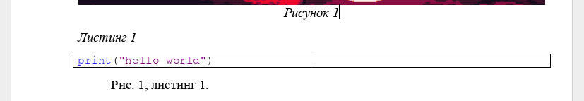

# md2gost

Скрипт для генерации docx отчета в соответствии с ГОСТ из markdown файла.

[Roadmap проекта](https://swift-turquoise-639.notion.site/c28b6a70173c4a35ace9385c25225bb6?v=fa46ce943a1d4f13bf574d665a0b0111&pvs=4).

## Основные возможности
- Генерация отчета;
- Добавление титульной страницы в формате docx;
- Генерация интерактивного содержания;
- Поддержка сквозной нумерации и кросс-референсинга;
- Автоматическая расстановка рисунков, продолжений таблиц и листингов и т.д.

## Пример
Markdown-файл: [example.md](https://github.com/witelokk/md2gost/blob/main/examples/example.md).

Сгенерированный файл в zip архиве (команда `python -m md2gost --syntax-highlighting example.md`): [example.zip](https://nightly.link/witelokk/md2gost/workflows/example-generator/main/example.zip?h=f65c99d31a9379f44fcc6e923de4a735a271d5aa).

## Установка
```bash
pip install --upgrade git+https://github.com/witelokk/md2gost.git@main
```

Если ваша система приняла стандарт [PEP 668](https://peps.python.org/pep-0668/), используйте [pipx](https://pypa.github.io/pipx/):
```bash
pipx install git+https://github.com/witelokk/md2gost.git@main
```

## Использование
```
(python -m ) md2gost [-h] [-o OUTPUT] [-T TITLE] [--title-pages TITLE_PAGES] [--syntax-highlighting | --no-syntax-highlighting] [--debug] [filenames ...]
```

При отсутствии флага -o, сгенерированный отчет будет иметь имя с названием исходного файла и расширением .md.

## Фичи

### Добавление титульной страницы
Чтобы добавить титульную страницу, используйте флаг `--title`(`-T`) с путем до файла с титульной страницей (в формате docx).
Если в файле более чем одна страница, используйте флаг `--title-pages` с количеством страниц.

Пример `md2gost report.md --title title.docx --title-pages 2`

### Подписи рисунков, листингов, таблиц
Рисунки:
```markdown

```

Таблицы:
```markdown
% Caption text

| a | b | c |
|---|---|---|
| a | b | c |
```

Листинги:
~~~markdown
% Caption text

```python
print("hello world")
```
~~~

Формулы:
```markdown
%

$$
2 + 2 = 4
$$
```

### Ссылки (кросс-референсинг)
Чтобы вставить кликабельный номер картинки/листинга/etc, используйте
~~~markdown


%code

```python
print("hello world")
```

Рис. @pic, листинг @code.
~~~

Результат:


### Заголовки для основных разделов
Для того чтобы у заголовка не было сквозной нумерации (например для заголовка Содержание), используйте 
```markdown
# *СОДЕРЖАНИЕ
```

### Генерация содержания
```markdown
[TOC]
```

### Подсветка синтаксиса в листингах
Используйте флаг ```--syntax-highlighting```

### Импорт кода в листингах
~~~markdown
```python code.py
```
~~~
где `code.py` - путь до файла с кодом
